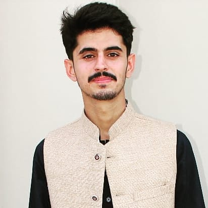

## Outreachy

> Hello All :). I am writing this blog to document my internship with Outreachy.
> Internship run December 5, 2022 to March 3, 2023
> I will be publishing one blog by the end of every week. 

<!--    -->

 

## Who am i ?
My name is **Hassan Asghar**. I am an Openstack Intern in **Outeachy** for project **Implement features for Manila User Interface**.
My mentors for this project are **Goutham Pacha Ravi and Carlos da Silva**. I have done my bachelors in Computer Science and I have worked as a freelancer in Fiverr and Upwork. My tasks include scripting and automation in python.

### My Core Values
 **My core values are**:
 1. **Determination and hardwork** 
 Determination and hardworking are two important factors to grow in every field. I beilive that these when combined produce bet results for anyone.

 2. **Humble** 
 My friends call me a humble person. I think it is good quality which helps and binds stronger and professional relationships. 

 3. **Trustworthy**
 To build any relationship, you need to trust other person for healthy and loyal relationship and i think and i am the one who can be trusted. 

 ## About this week 
 > We started of with a meeting of almost 1 hour which was introductory meetings with my both mentors.
 > We both shared our background and discussed weekly tasks.
 > To sum up, our agenda for a week 1 was :
  1. Define a recurring meeting slot
  2. Keeping connected to Zulip
  3. Setting up IRC and OpenStack accounts
  4. Accessing the environment
  5. Installing devstack
  6. Clone manila-ui and horizon

 We started with defining recurring slot for our weekely meetings, and keeping connected on Zulip with other members.
 Once done with that i have created necessary accounts required to start my project. My mentors have provided me with VM, to access my work remotely. So the real challenge was installing devstack on my VM. I already have discussed with my mentors how to follow the approach to install devstack, and they had aslo shared resources to follow along. After creating necessary accounts for devstack , i have cloned the actual code from GitHub. Then i have created a local.conf file that would have all the guidelines to install resources required. As suggested by Gautham, i have added manila-ui in local.conf file and started installation for devstack, but it was failing continuously due to the tempest error, i pinged my mentors, Carlos replied to remove host_ip part as it was not necessary and then try a re run but it failed again, Carlos also tried on his part but it got failed. I somehow removed the manila-ui line from local.conf file and then tried re-run and it got successfully installed but as Gautham suggested adding that manila-ui backend, the installation was just as half a way. We discussed again the situation and Carlos suggested that it is open source and changes are happening continuously and at that time i tried installation, bug might be was in progress state, and we were facing error then upon retrying we were able to successfully install devstack along with manila-ui.

 Along with my tasks, hosting blog was also quite challenging as i had already purchased domain with my name and hosting was a bit expensive, after some findings and research i came with this amazing cloud hosting service whicb provides boiler plate for a blogs and can directly take your code from GitHub and hosts thereon your custom domain.

 > So this was all about my first week and now we are moving towards second. See you :)

